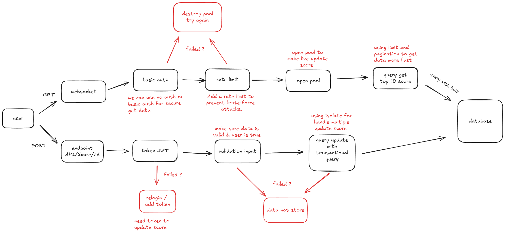

# Software Module : Score Board Live Update

## Overview

This document outlines the requirements and implementation details for the Scoreboard Module of our website, which tracks and displays the top 10 user scores in real time. The module includes mechanisms for score updates, API interactions, and security measures to prevent unauthorized score manipulation.

## Software Requirements

1. Scoreboard Display
    - The scoreboard should display the top 10 user scores.
    - The display should be updated in real-time to reflect any changes in user scores.

2. User Action
    - User can inscrease score by completing an action.
    - Updating score should be done through API call.

3. Realtime Update
    - The score board should be updated in real time.
    - The score board should be automatically updated when a user makes an action.
    - Using websocket to achieve realtime update.

## Diagram Architecture



## Security Measures

1. User Authentication
    - For every update action, user need to be authenticated using JWT token.
    - JWT token is generated when user login.
    - Websocket using basic auth for every pooling request.

2. User Authorization
    - Using user id to authorize the score update action.
    - User can only update their own score.

3. Input Validation
    - Input data will be validated by server side.
    - Server will check the data is valid and not malicious.

4. Rate Limiting
    - Every pooling request will be rate limited.
    - Rate limit is 10 requests per second with same IP address.

5. Data Protection
    - Getting data always uses limitations to avoid overloading the server when the query is executed.
    - Data is stored using transaction queries to avoid data corruption.

## Implementation Details

1. Scoreboard Display
    - When user open the scoreboard page, websocket request will be sent to get the top 10 scores.
    - Every pooling request only get 10 data from database start from the largest score.
    - For every request, the server will check the rate limit.

2. User Action
    - User completes an action.
    - Client-side initiates POST `/api/score/update` with userId and scoreIncrement.
    - Server validates user authentication, verifies userId, and checks scoreIncrement.
    - If validations pass, the score is updated in the database.

3. Realtime Update
    - When user login, websocket will be activated.
    - The server emits an event via WebSocket to notify all connected clients about the score change.

## Request & Response

### API Endpoints
- Update Score
    - Endpoint: POST `/api/score/update`
    - Request Body:
        ```json
        {
            "userId": "user123",
            "scoreIncrement": 10
        }
        ```

    - Response: 
        - Success  `201` (Created)
        ```json
        {
            "message": "Score updated successfully"
        }
        ```
        
        - Failure (4xx / 5xx Status Codes):
            - `400` Bad Request: Invalid input data.
            - `401` Unauthorized: User not authenticated or token invalid.
            - `403` Forbidden: User does not have permission to perform this action.
            - `404` Not Found: User not found.

### WebSocket Events

- Initial Connection
    - Event: `initialConnection`
    - Payload:
        ```json
        {
            "action": "initialConnection",
            "data": {
                "userId": "12345",
                "userName": "JohnDoe",
                "score": 100
            }
        }
    }

- Score Update Notification
    - Event: `scoreUpdate`
    - Payload:
        ```json
        {
            "action": "scoreUpdate",
            "data": {
                "userId": "12345",
                "userName": "JohnDoe",
                "newScore": 150,
                "topScores": [
                    {
                        "userId": "54321",
                        "userName": "AliceSmith",
                        "score": 200
                    },
                    {
                        "userId": "67890",
                        "userName": "BobBrown",
                        "score": 180
                    },
                    {
                        "userId": "12345",
                        "userName": "JohnDoe",
                        "score": 150
                    },
                    ...
                ]
            },
            "message": "Score updated successfully"
        }


## Conclusion

The scoreboard application is a real-time application that requires a persistent connection. WebSocket is one solution to achieve this. It is combined with API endpoints to allow users to submit their scores instantly and view updates from other players.

For security measures, we chose basic authentication for WebSocket connections, allowing everyone to view the top scores without logging in. However, users must log in to post their scores, using JWT (JSON Web Token) authentication for added security.

On the server side, we implement rate limiting to control the number of connections via WebSocket. Additionally, we use query limits for fetching data and transactional queries for handling score submissions. This combination of features ensures efficient and secure operation of the application.